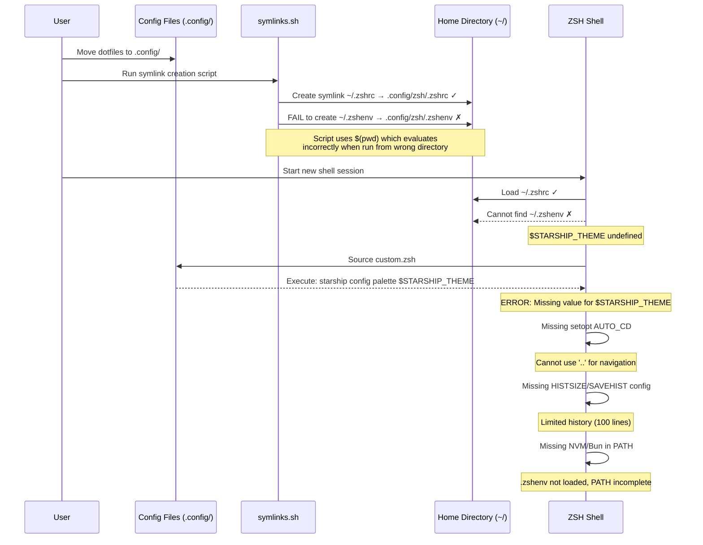

# Shell Configuration Migration Incident - Root Cause Analysis

## Event Sequence



## Multi-Angle Analysis

### 1. **Technical Analysis**
- **Symlink Creation Issue**: The symlinks.conf file uses `$(pwd)` which expands to the current working directory when the script is run. If the script was not run from `/Users/parkerrex/.config`, the source paths would be incorrect.
- **Missing .zshenv Symlink**: The critical `.zshenv` file that contains environment variables (including `STARSHIP_THEME`) was not symlinked to the home directory, breaking the shell initialization chain.
- **Shell Configuration Dependencies**:
  - `STARSHIP_THEME` is defined in `.zshenv` (line 15)
  - Used in `custom.zsh` (line 20) without checking if defined
  - ZSH loads `.zshenv` before `.zshrc`, so missing symlink breaks this chain

### 2. **Operational Analysis**
- **Incomplete Migration**: The dotfiles migration was only partially successful - some symlinks were created while critical ones were missing
- **Script Execution Context**: The symlink script likely failed silently or was run from the wrong directory
- **Testing Gap**: No verification step to ensure all required symlinks were created successfully

### 3. **Environmental Analysis**
- **Shell Loading Order**: ZSH loads configuration in specific order: `.zshenv` → `.zprofile` → `.zshrc` → `.zlogin`
- **Missing Shell Options**:
  - No `setopt AUTO_CD` for directory navigation shortcuts
  - No history configuration (`HISTSIZE`, `SAVEHIST`, `HISTFILE`)
- **PATH Dependencies**: NVM and Bun installations depend on PATH modifications that would normally be in `.zshenv`

### 4. **Monitoring Analysis**
- **Silent Failures**: The symlink script continues even when source files are not found (line 33-35 in symlinks.sh)
- **No Validation**: No post-execution validation to verify all expected symlinks exist
- **Error Visibility**: Warnings are issued but the script doesn't fail, making partial success look like complete success

## Root Cause Analysis

### **Primary Root Cause**
**Failed symlink creation for `.zshenv`** - The critical `.zshenv` file containing environment variables and initial PATH setup was not symlinked from `.config/zsh/.zshenv` to `~/.zshenv`, breaking the shell initialization chain.

### **Contributing Factors**
1. **Script Execution Context Issue**: The symlinks.conf uses `$(pwd)` which evaluates based on where the script is run, not where the config file is located
2. **Missing Shell Configuration**: Essential ZSH options (`AUTO_CD`) and history settings not configured in any of the loaded files
3. **Unchecked Variable Usage**: `custom.zsh` uses `$STARSHIP_THEME` without checking if it's defined
4. **Silent Script Failures**: The symlink script continues execution even when critical symlinks fail

### **Timeline of Failure**
1. User moves dotfiles to `.config/` directory structure
2. User runs symlink script (possibly from wrong directory)
3. Script creates some symlinks successfully (`.zshrc`) but fails on others (`.zshenv`)
4. User starts new shell session
5. Shell loads `.zshrc` but cannot find `.zshenv`
6. Environment variables remain undefined
7. Starship command fails due to missing `$STARSHIP_THEME`
8. Shell features (auto-cd, history) don't work due to missing configurations
9. NVM/Bun not in PATH due to missing environment setup

### **Impact Assessment**
- **User Experience**: Degraded shell functionality affecting daily development workflow
- **Features Affected**:
  - Starship prompt throws errors on every shell start
  - Directory navigation requires explicit `cd` command
  - Limited shell history (100 lines vs configured amount)
  - NVM and Bun require reinstallation/reconfiguration
- **Severity**: Medium - System functional but with significant usability issues

### **Prevention Recommendations**

#### Immediate Fixes Required
1. Create missing `.zshenv` symlink: `ln -s ~/.config/zsh/.zshenv ~/.zshenv`
2. Add defensive check in `custom.zsh`:
   ```bash
   [ -n "$STARSHIP_THEME" ] && starship config palette $STARSHIP_THEME
   ```
3. Add essential ZSH options to `.zshrc`:
   ```bash
   setopt AUTO_CD
   setopt EXTENDED_HISTORY
   setopt HIST_EXPIRE_DUPS_FIRST
   setopt HIST_IGNORE_DUPS
   setopt HIST_IGNORE_SPACE
   setopt HIST_VERIFY
   setopt INC_APPEND_HISTORY
   setopt SHARE_HISTORY
   HISTFILE=~/.zsh_history
   HISTSIZE=10000
   SAVEHIST=10000
   ```

#### Process Improvements Needed
1. **Symlink Script Enhancement**:
   - Use absolute paths instead of `$(pwd)`
   - Add validation after symlink creation
   - Exit on critical failures
   - Add dry-run mode for testing

2. **Configuration Validation**:
   - Create a validation script that checks all required symlinks exist
   - Verify environment variables are set correctly
   - Test shell features after configuration changes

#### Monitoring/Alerting Enhancements
1. Add shell startup diagnostics that report missing configurations
2. Create a health check script for dotfiles setup
3. Log symlink creation results with success/failure status

#### Code/Architecture Changes
1. **Decouple Configuration**: Move critical settings to files that are always loaded
2. **Fail-Safe Defaults**: Provide default values for all environment variables
3. **Modular Loading**: Use conditional sourcing with existence checks

#### Training or Documentation Updates
1. Document the correct procedure for running the symlink script
2. Create a troubleshooting guide for common shell configuration issues
3. Add pre-flight checklist before migrating dotfiles
4. Document the shell configuration loading order and dependencies

### **Lessons Learned**
1. **Always use absolute paths** in configuration scripts to avoid context-dependent behavior
2. **Validate critical dependencies** before using them (check if variables are defined)
3. **Implement comprehensive validation** after configuration changes
4. **Design for partial failure** - scripts should either succeed completely or roll back
5. **Test configuration changes** in a new shell session immediately after making them
6. **Document dependencies clearly** - which files depend on which environment variables
7. **Provide meaningful error messages** when configuration is incomplete